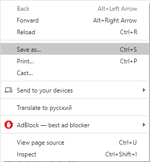

# NeuroStartUp README.md

# NeuroStartUp

NeuroStartUp — динамически развивающийся стартап, специализирующийся на поиске с использованием новейших технологий искусственного интеллекта. Наши преимущества:
* Высокая точность поиска;
* Высокая скорость поиска;
* Низкая цена.

## Начало работы

Для того чтобы пользоваться продуктом - просто скопируйте его!

### Необходимости

Для того, чтобы пользоваться продуктом необходимо скачать продукт:

### Запуск

Пошаговый процесс установки и запуска:

DoubleClick на исполняемый файл приложения

## Лицензия

Freeware